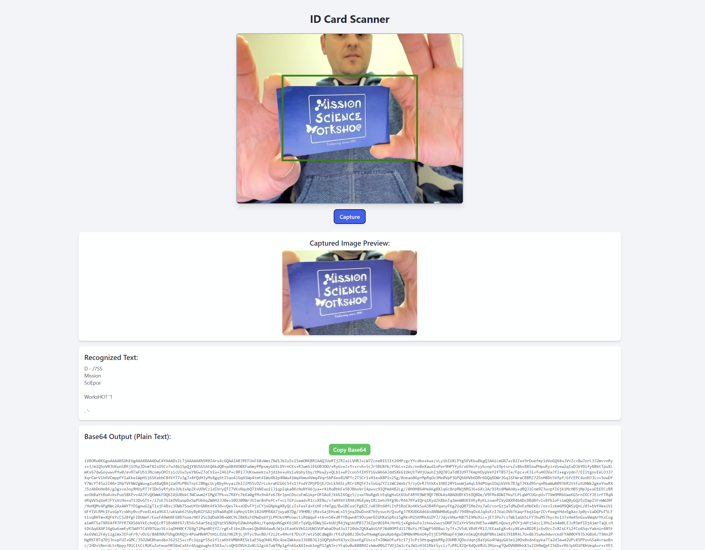

# ID Card Scanner

The ID Card Scanner is a web application that allows users to capture an image of an ID card using their webcam, perform Optical Character Recognition (OCR) on the captured image, and display the recognized text. The application also provides the option to copy the Base64 encoded string of the captured image.

## Features

- **Live Video Capture**: Utilizes the user's webcam to capture live video.
- **Image Capture**: Allows users to capture an image of the ID card.
- **OCR Processing**: Uses Tesseract.js to perform OCR on the captured image and extract text.
- **Base64 Encoding**: Converts the captured image to a Base64 string and displays it.
- **Copy Functionality**: Provides a button to copy the Base64 string to the clipboard.

## How to Use

1. **Access the Application**: Open the application in a web browser. You can try it out at [ID Card Scanner](https://card-scanner.pages.dev/).
2. **Allow Webcam Access**: Grant permission for the application to access your webcam.
3. **Capture Image**: Position the ID card within the green rectangle on the video feed and click the "Capture" button.
4. **View Results**: The captured image will be displayed, and the recognized text will appear below it.
5. **Copy Base64 String**: If needed, click the "Copy Base64" button to copy the Base64 string of the image to your clipboard.

## Technologies Used

- **HTML/CSS**: For structuring and styling the web page.
- **JavaScript**: For handling video capture, image processing, and OCR.
- **Tesseract.js**: A JavaScript library for performing OCR.
- **Tailwind CSS**: A utility-first CSS framework for styling.

## License

This project is open-source and available under the MIT License.

## Acknowledgments

- [Tesseract.js](https://github.com/naptha/tesseract.js) for providing the OCR functionality.
- [Tailwind CSS](https://tailwindcss.com/) for the styling framework.
